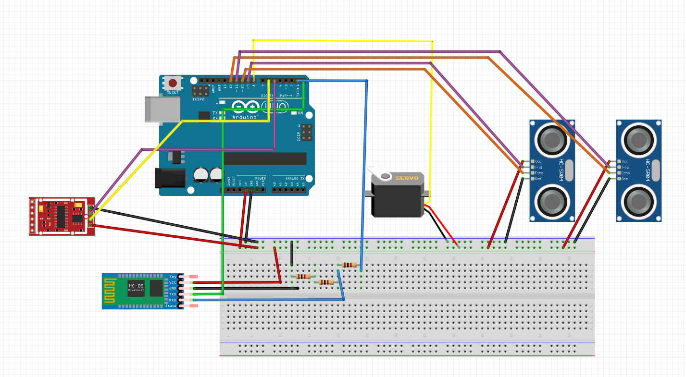

# Smart bin arduino code 
Built during Singapore India Hackathon 2019. A smart bin which communicates with [@RohanGautam/Waste-Management-App](https://github.com/RohanGautam/Waste-Management-App) via bluetooth serial communication.

## Features
* Secure transportation system
* 2-Party Authentication to Lock/Unlock - Immediate authority transfer
* Only Lock/Unlock at valid Geo-Fence
* Upload all transactions to append-only database
* Measure volume/weight at hospital and facility
## Components:
* Bluetooth module (HC-05)
* Ultrasonic distance sensors x2 (SR04)
* Weight sensor (HX711)
* Micro servo [Note: you have to provide it with an external power supply, like another USB's power line, but it has to have the ground connection in the arduino]

## Schematic:

